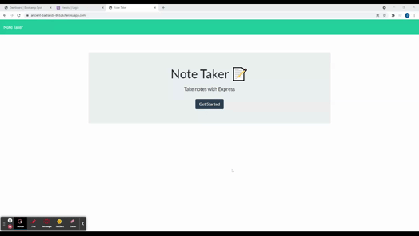

# note-taker
An application that can be used to take and record notes using Express.

## Table of contents

- [Description](#description)
- [Deployed](#deployed)
- [Demo](#demo)
- [Installation](#installation)
- [Usage](#usage)
- [Tech](#tech)
- [Contributions](#contributions)
- [Github](#github)
- [Contact](#contact)
- [License](#license)


## Description

This application uses Express to write, save, and delete notes. The data is saved and retrieved from the JSON file. This application helps a user organize to do lists, events, and other reminders they might need to prioritize while also being able to delete items as needed. 

  

## Deployed
[Click here for deployed application](https://ancient-badlands-86526.herokuapp.com/)


## Demo





## Installation
This application requires the installment of 'express' and 'uuid' to run properly. To install the required dependencies, please run:
  ```
      npm install express
      npm install uuid
  ```


## Usage
After the required dependencies are installed, open the terminal and run the following command line. The link will appear in the terminal, or you can go to the deployed site using the following link: <https://ancient-badlands-86526.herokuapp.com/>
  ```
    node server.js
  ```


## Tech

 * VS Code
 * Node.js
 * Express
 * Heroku

## Contributions

This project was made with help from:

* UNCC BootCamp class


## Github
Below is the link to the github repository for this project

<https://github.com/jessgreene9/note-taker>

## Contact

    
For any questions about this project, please visit my GitHub page: [GitHub Profile](https://github.com/jessgreene9)
      
Or email me at: [Jess Greene](mailto:jess.greene9@gmail.com)


## License

[](https://opensource.org/licenses/MIT)
  
  